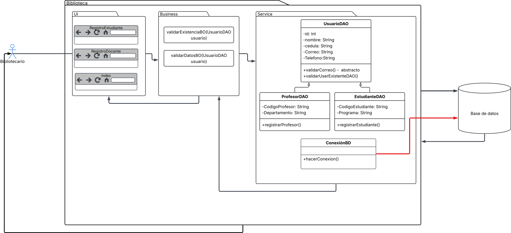
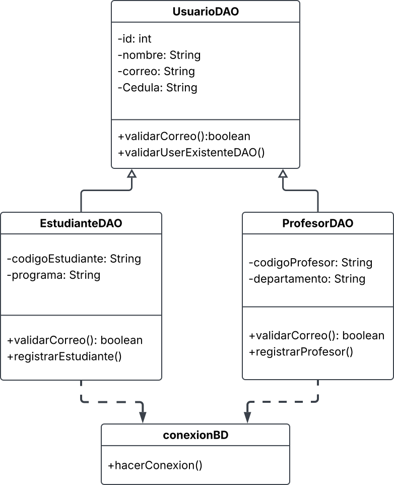

<h1 align= "center"> G-LIBRARY</h1>

>[!NOTE]
> Este es un proyecto académico.

<h2 align= "center"> Introducción</h2>

>[!IMPORTANT]
> Antes de clonar el repositorio asegurate de leer el README completo ;D

## Descripción
Sistema de gestión bibliotecaria donde administradores y bibliotecarios se encargan de gestionar las diferentes funciones para los usuarios.

## Características principales
- Gestionar libros. 
- Gestionar usuarios. 
- Gestionar prestamos.
- Generar reportes.
- Gestionar acceso al sistema.

>[!NOTE]
> Por el momento, solo se trabajará con el requerimiento "Gestionar usuarios" el cual se encuentra en desarrollo.


## Tecnologías utilizadas 

| Tecnología | Uso en el proyecto | Versión declarada en `pom.xml` |
|---|---|---|
| Java | Lenguaje principal | 26 |
| JavaFX | Interfaz gráfica de escritorio | 21 |
| JavaFX CSS | Estilos de la interfaz (`src/UI/estilos.css`) | — |
| MySQL | Base de datos relacional (vía XAMPP) | 8.x |
| MySQL Connector/J | Driver JDBC para conectar Java con MySQL | 9.4.0 |
| Maven | Gestión de dependencias y compilación | 3.9+ |

>[!WARNING]
> Nuestro `pom.xml` compila con `maven.compiler.source`/`target` en la version **26** de JDK (Java Development Kit). Si al ejecutar `mvn clean javafx:run` o `mvn javafx:run ` obtienes un error de *"release version not supported"*, instala **JDK 26** primero para que a no te falle la compilación por tener un JDK distinto.

## Requisitos previos

Antes de clonar el repositorio y ejecutar el proyecto, instala:
 
1. **JDK 26** 

```bash
   java -version
```
Esto para revisar que version de java tienes.


2. **Apache Maven** 3.9 o superior.

```bash
   mvn -version
```
Esto para revisar que version de maven tienes.

3. **XAMPP** con el módulo **MySQL** iniciado. Por defecto la app se conecta a `localhost:3306` con usuario `root` y sin contraseña (configuración por defecto de XAMPP). No tienes que hacer mucho aquí.

4. **Git**, para clonar el repositorio.

5. *(Opcional)* Un IDE con soporte para Maven: IntelliJ IDEA, Eclipse, o VS Code con la extensión **"Extension Pack for Java"**.

## Instalación y ejecución
 
### 1. Clonar el repositorio
```bash
git clone https://github.com/EthanAlejandroM/g-library.git


cd g-library
```
### 2. Crear la base de datos (con phpMyAdmin)

1. Abre **XAMPP Control Panel** e inicia el módulo **MySQL** (botón *Start*). Apache no es necesario.

2. Entra a phpMyAdmin: `http://localhost/phpmyadmin`.

3. En el panel izquierdo, clic en **"Nueva"** y crea una base de datos llamada exactamente **`g-library`**.

>[!IMPORTANT]
> El nombre debe ser ese, totalmente igual, ya que es el que `ConexionBD.java` usa para conectarse y si pones otro nombre no te va a conectar y por lo tanto no podras ver los usuarios que registres.

4. Con `g-library` ya seleccionada en el panel izquierdo, ve a la pestaña **"Importar"** (arriba).

5. En **"Seleccionar archivo"**, elige el archivo [`database/BibliotecaBO`](database/BibliotecaBO) de este repositorio, y da clic en **"Continuar"** al final de la página.

6. Ya con eso deberían aparecerte las tablas `usuario`, `estudiante` y `profesor` dentro de `g-library`. Con eso ya tienes la base de datos lista.

>[!NOTE]
> Esta base de datos es **local** y todavía no es la definitiva del proyecto: cada integrante crea la suya siguiendo estos mismos pasos, y no comparten datos entre sí (lo que tú registres solo lo ves tú). Es una versión funcional temporal mientras se define una base de datos real. 


### 3. Compilar y ejecutar
Desde la raíz del proyecto:

```bash
mvn clean javafx:run
```
Este comando descarga automáticamente JavaFX y el conector de MySQL (declarados en `pom.xml`), compila el código y abre la ventana de la aplicación.

## Diagramas

### Arquitectura — "Gestionar usuarios"


### Diagrama de Clases 


### Modelo entidad-relación (MER)
[Ver diagrama MER](docs/mer.jpeg)

### Estructura del proyecto

```text
g-library/
├── database/
│   └── BibliotecaBO          
├── docs/
│   ├── Arquitectura.svg
│   ├──DiagramaClases.svg
│   └── mer.jpeg
├── src/
│   ├── Business/
│   │   └── GestionUsuario.java      
│   ├── Service/
│   │   ├── ConexionBD.java          
│   │   ├── UsuarioDAO.java          
│   │   ├── EstudianteDAO.java       
│   │   ├── ProfesorDAO.java         
│   │   ├── UsuarioConsultaDAO.java  
│   │   └── UsuarioVista.java        
│   └── UI/
│       ├── Interfaz.java            
│       ├── PanelEstudiante.java     
│       ├── PanelProfesor.java       
│       ├── PanelUsuarios.java       
│       └── estilos.css              
├── .gitignore
├── config.properties.example
├── CONTRIBUTING.md
├── pom.xml
└── README.md
```

## Autores
- Nicolle Mera 
- Ethan Alejandro Mezu 
- Robinson Elian Corrales
- Jesus David Tobar