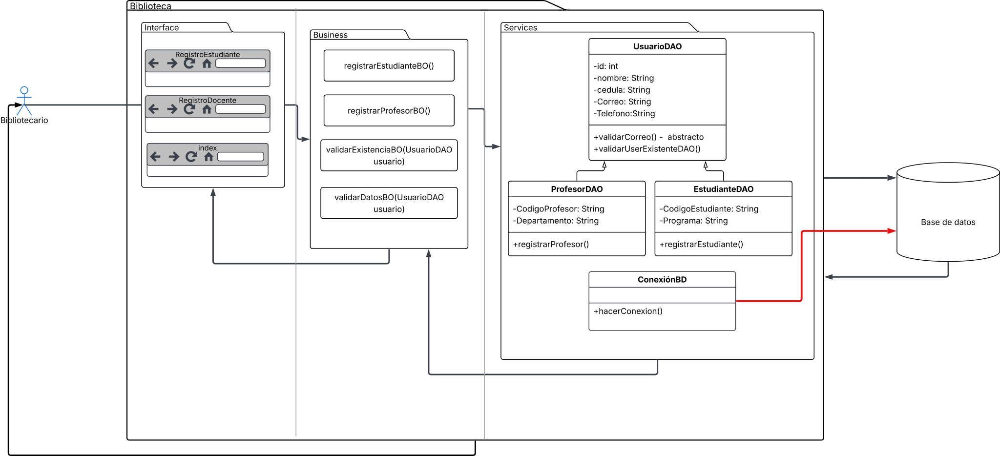

<h1 align= "center"> G-LIBRARY</h1>

[!NOTE]
> Este proyecto es académico.

<h2 align= "center"> Introducción</h2>

### Descripción
Sistema de gestión bibliotecaria donde administradores y bibliotecarios se encargan de gestionar las diferentes funciones para los usuarios.

### Características principales
- Gestionar libros. 
- Gestionar usuarios. 
- Gestionar prestamos.
- Generar reportes.
- Gestionar acceso al sistema.

[!NOTE]
> Por el momento, solo se trabajará con el requerimiento "Gestionar usuarios" el cual se encuentra en desarrollo.

### Tecnologías utilizadas 
- Java
- MySql
- JavaFX
- CSS

### Diagrama "Gestionar usuarios" 

